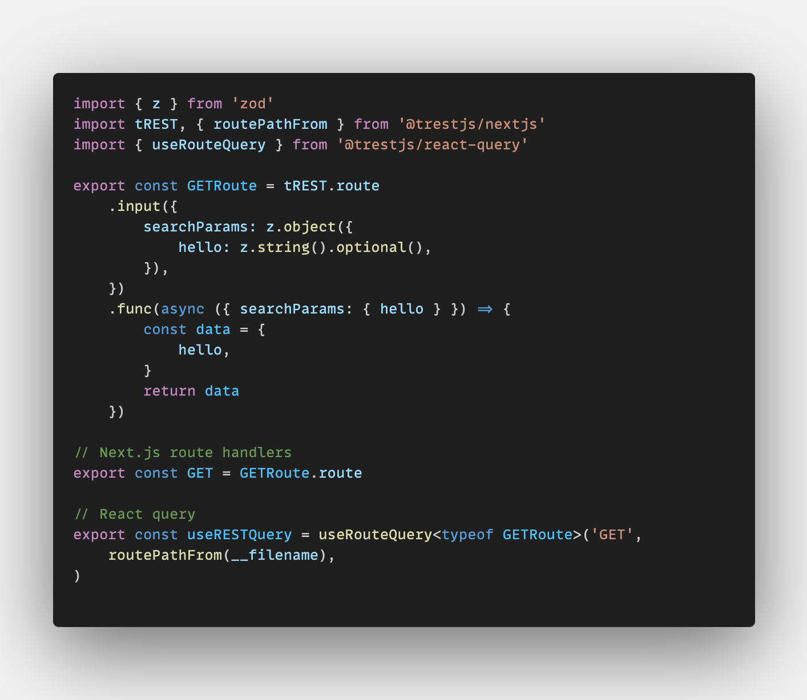

  <h1>tREST</h1>
  <h3>Move fast and break nothing, RESTfully. End-to-end typesafe REST APIs, the tRPC way.</h3>
  
   
  <figure>
    
    <figcaption>
      

        The client above is <strong>not</strong> importing any code from the server, only its type declarations.
      

    </figcaption>
  </figure>

 